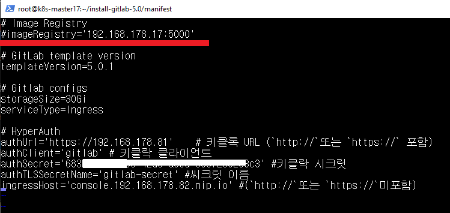
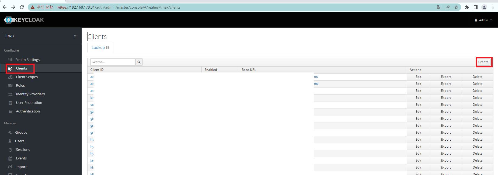
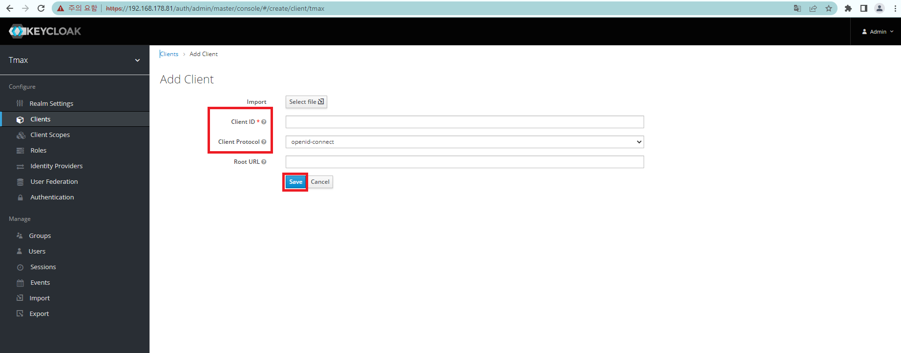
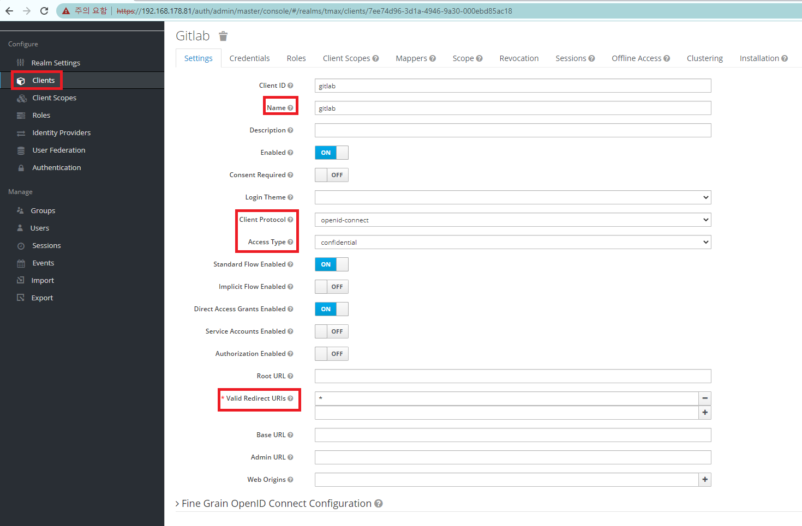
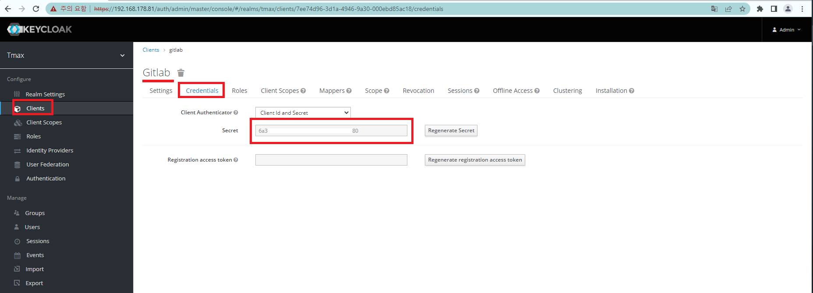
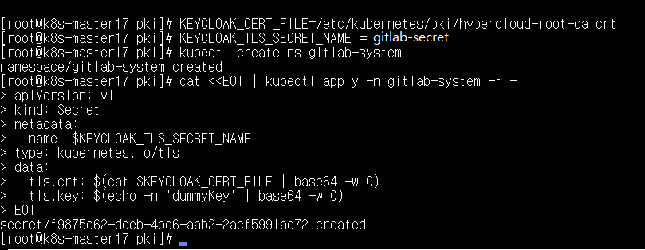
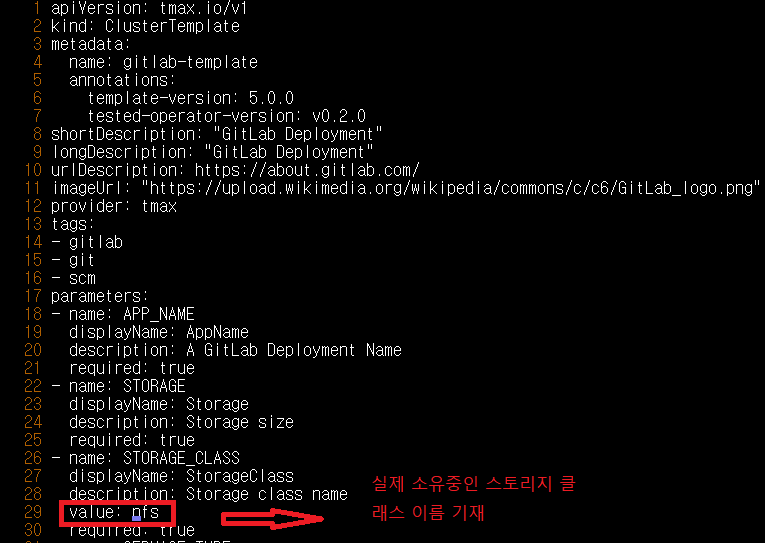

# GitLab 설치 가이드

## 구성 요소 및 버전
* gitlab ([gitlab/gitlab-ce:13.6.4-ce.0](https://hub.docker.com/layers/gitlab/gitlab-ce/13.6.4-ce.0/images/sha256-5c8937153d7d1373d6b2cbe6f3c5e4b80e85f13aa21c09261d7d02960d7bb774?context=explore))
* bitnami/kubectl ([bitnami/kubectl](https://hub.docker.com/layers/bitnami/kubectl/latest/images/sha256-c2844926575f75dcefbc67a1375531bcfaea07cd404e57bdc274380a513be2bd?context=explore))

## Prerequisite
* Template Operator

## 폐쇄망 설치 가이드
설치를 진행하기 전 아래의 과정을 통해 필요한 이미지 및 yaml 파일을 준비한다.
1. 폐쇄망에서 설치하는 경우 사용하는 image repository에 Gitlab 설치 시 필요한 이미지를 push한다.
2. 퍼블릭망에서 설치하는 경우 image repository를 공란으로 주석처리합니다


 * 작업 디렉토리 생성 및 환경 설정
   ```bash
   
   git clone https://github.com/learncloud/install-gitlab-5.0.git
   cd manifest
   chmod 777 installer.sh
   # public망에서 설치할 경우, gitlab.config에서 imageRegistry를 주석처리
   
   ```
   
   
       
 * `gitlab.config` 파일 수정
   ```config
   #imageRegistry=172.22.11.2:30500 # 레지스트리 주소 (폐쇄망 아닐 경우 주석처리)
   imageRegistry=192.168.178.17:5000 # 레지스트리 주소 (폐쇄망 아닐 경우 빈 값으로 설정)
  
   # 아래는 Keycloak 연동시 기재 필요
   authUrl='https://192.168.178.81' # 키클록(hyperauth) URL (`http://`또는 `https://` 포함)
   authClient='gitlab' # 키클록 클라이언트 이름
   authSecret='*******' # 키클록 클라이언트 시크릿
   authTLSSecretName='gitlab-secret' # TLS 시크릿 이름 , 임의 설정
   custom_domain_name='tmaxcloud.org' #(`http://`또는 `https://`미포함)
   # custom_domain_name='console.192.168.178.82.nip.io'
   
   ```
   
 * 위의 과정에서 생성한 tar 파일들을 폐쇄망 환경으로 이동시킨 뒤 사용하려는 registry에 이미지를 push한다.
   - 현재는 public망에서 구축하는 시나리오
   ```bash
   ./installer.sh prepare-online
   #./installer.sh prepare-offline
   # cicd-ns쪽 tar파일이 없어서 현재는 생성이 안됨. 실제 고객사 들어갈때 or offline으로 생성하고싶으면 해당 이미지파일(.tar)을 docker pull push해야할듯)
   
   ```

1. 폐쇄망 환경으로 전송
   ```bash
   # 생성된 파일 모두 SCP 또는 물리 매체를 통해 폐쇄망 환경으로 복사
   cd ../..
   scp -r install-gitlab <REMOTE_SERVER>:<PATH>
   # scp -r install-gitlab 192.168.178.17:5000
   
   ```

2. **(Keycloak 연동 시-hyperauth)**
    0. 키클록에서 클라이언트 생성
    - Client → Create
    - Client ID : gitlab
    - Client Protocol : openid-connect
    - Save 클릭
    
    
    
    

    1. Settings부분에서 클라이언트에 대한 설정을 진행
    
    - Name: `gitlab`
    - Client-Protocol: `openid-connect`
    - AccessType: `confidential`
    - Valid Redirect URIs: `*`
   
    
   

    2. 클라이언트 시크릿 복사
    - `Client > gitlab > Credentials > Secret` 복사
   
    

    3. TLS 시크릿 
       
         **HyperAuth를 사용할 경우 HyperAuth 설치 시 마스터 노드들에 설치된 `/etc/kubernetes/pki/hypercloud-root-ca.crt` 인증서 사용**
         
         ```bash
         # 변수 지정하듯 진행
         #맞는지 모르지만 해당 내용 스크린샷으로 바탕화면에 있음
         KEYCLOAK_CERT_FILE=<인증서 파일 경로>
         # KEYCLOAK_CERT_FILE=/etc/kubernetes/pki/hypercloud-root-ca.crt
         KEYCLOAK_TLS_SECRET_NAME=<Keycloak TLS 인증서가 저장될 Secret 이름> # Secret명 'gitlab-secret' 넣으면됨, 넣는 이유는 아래 Secret 이름에 들어갈
         # KEYCLOAK_TLS_SECRET_NAME=gitlab-secret
         
         kubectl create ns gitlab-system
         
         cat <<EOT | kubectl apply -n gitlab-system -f -
         apiVersion: v1
         kind: Secret
         metadata:
           name: $KEYCLOAK_TLS_SECRET_NAME
         type: kubernetes.io/tls
         data:
           tls.crt: $(cat $KEYCLOAK_CERT_FILE | base64 -w 0)
           tls.key: $(echo -n 'dummyKey' | base64 -w 0)
         EOT
         ```
         
         


## 설치 가이드
1. [GitLab 설치](#step-1-gitlab-설치)

## Step 1. GitLab 설치
* **POD가 올라오기까지 시간이 매우 소요**
* 목적 : `GitLab에 필요한 구성 요소 설치`
* 생성 순서 : 아래 command로 설치 yaml 적용
   ```bash
   # 우선적으로 gitlab에 할당해줄 storage class volume이름 을 써줘야합니다
   cd ~/install-gitlab-5.0/manifest/yaml
   vi template.yaml
   #28번째줄  Storage class name이름 수정
   #   value: nfs
   ./installer.sh install
   ```
  

## 삭제 가이드
1. [GitLab 삭제](#step-1-gitlab-삭제)

## Step 1. GitLab 삭제
* 목적 : `GitLab 구성 요소 삭제`
* 생성 순서 : 아래 command로 설치 yaml 삭제
   ```bash
   ./installer.sh uninstall
   ```
